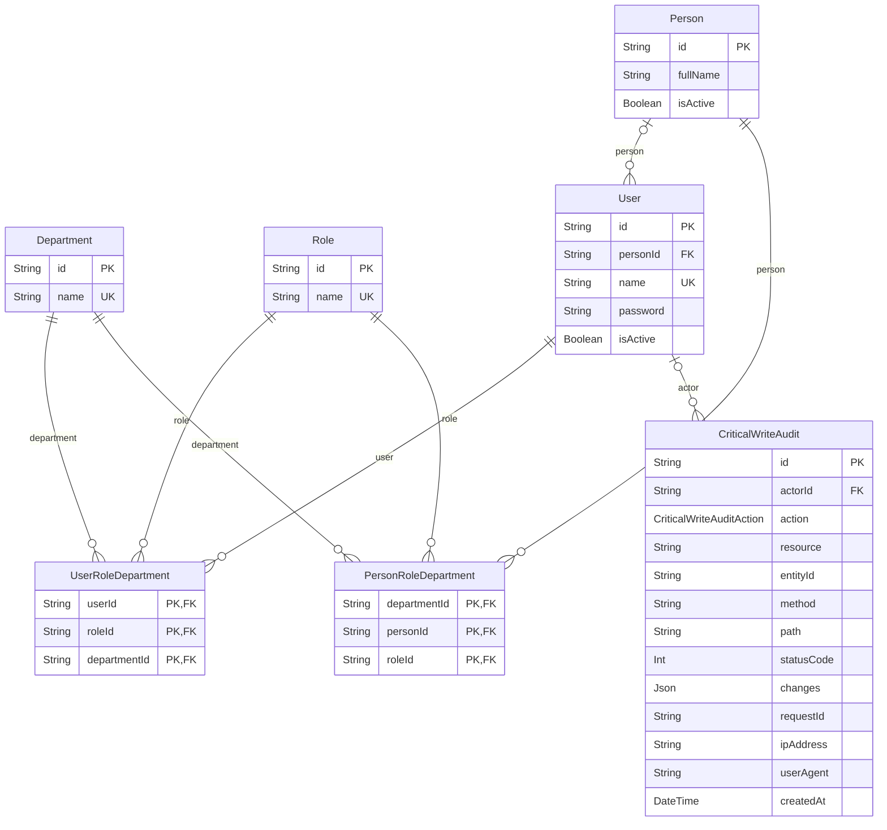
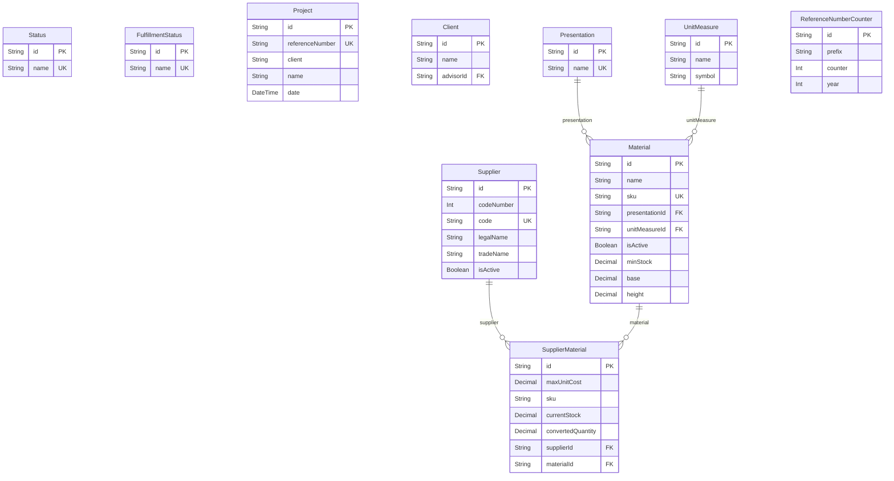
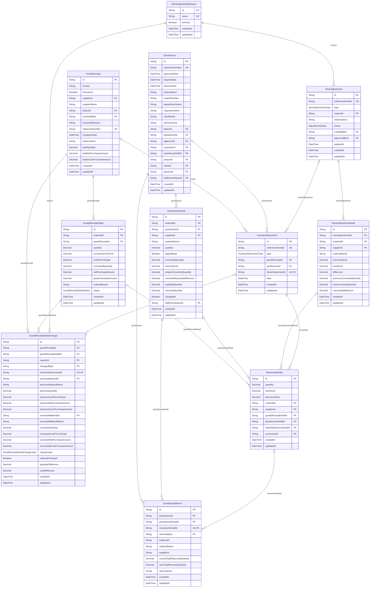
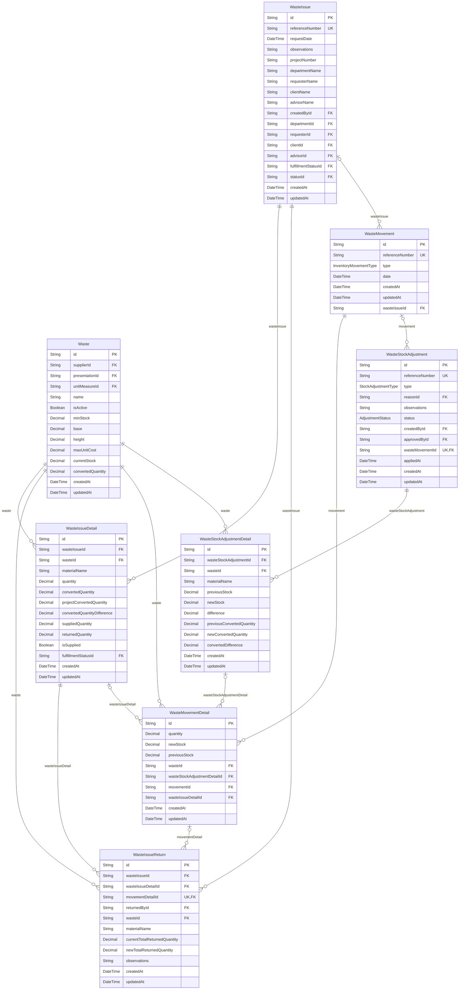

<!-- Archivo generado por scripts/generateArchitectureDocs.js. No editar manualmente. -->
# Diagramas de la base de datos

Estos diagramas ER se generan desde los modelos y relaciones de
`prisma/schema.prisma`. Se separan por área para que puedan leerse y revisarse en
GitHub; las relaciones que cruzan áreas se describen en la sección final. La semántica
y el patrón de esta vista se describen en las
[convenciones de diagramas](../architecture/diagram-conventions.md).

La marca `PK` identifica claves primarias, `FK` claves foráneas y `UK` campos
únicos. Los campos compuestos y demás restricciones siguen teniendo como fuente de
verdad el esquema Prisma y sus migraciones. Para consultar obligatoriedad, valores
predeterminados y tipos de cada campo, usa el
[diccionario técnico](data-dictionary.md).

## Identidad, acceso y auditoría

## Catálogos y relaciones comerciales

## Compras e inventario de materiales

## Mermas e inventario de merma

## Relaciones entre áreas

Los modelos de identidad y catálogo son referenciados desde los documentos de compra,
salida, ajuste y merma. Para evitar repetir entidades y producir diagramas ilegibles,
cada diagrama anterior detalla las relaciones internas de su área y la vista siguiente
muestra sólo las asociaciones que cruzan esos límites. Los atributos permanecen en las
vistas por área y en el diccionario técnico.

```mermaid
erDiagram
    Supplier ||--o{ Waste : "supplier"
    Presentation ||--o{ Waste : "presentation"
    UnitMeasure ||--o{ Waste : "unitMeasure"
    StockAdjustmentReason ||--o{ WasteStockAdjustment : "reason"
    User ||--o{ WasteStockAdjustment : "createdBy"
    User o|--o{ WasteStockAdjustment : "approvedBy"
    User ||--o{ WasteIssue : "createdBy"
    Department ||--o{ WasteIssue : "department"
    Person ||--o{ WasteIssue : "requester"
    Client ||--o{ WasteIssue : "client"
    Person ||--o{ WasteIssue : "advisor"
    FulfillmentStatus ||--o{ WasteIssue : "fulfillmentStatus"
    Status ||--o{ WasteIssue : "status"
    FulfillmentStatus ||--o{ WasteIssueDetail : "fulfillmentStatus"
    User o|--o{ WasteIssueReturn : "returnedBy"
    Person o|--o{ Client : "advisor"
    Person ||--o{ GoodsReceipt : "receivedBy"
    Supplier ||--o{ GoodsReceipt : "supplier"
    Status ||--o{ GoodsReceipt : "status"
    Material ||--o{ GoodsReceiptDetail : "material"
    Department ||--o{ GoodsIssue : "department"
    Person o|--o{ GoodsIssue : "approver"
    Person ||--o{ GoodsIssue : "requester"
    Person o|--o{ GoodsIssue : "warehouseStaff"
    Status ||--o{ GoodsIssue : "status"
    Project o|--o{ GoodsIssue : "project"
    Client ||--o{ GoodsIssue : "client"
    Person ||--o{ GoodsIssue : "advisor"
    FulfillmentStatus o|--o{ GoodsIssue : "fulfillmentStatus"
    Material ||--o{ GoodsIssueDetail : "material"
    Supplier ||--o{ GoodsIssueDetail : "supplier"
    FulfillmentStatus ||--o{ GoodsIssueDetail : "fulfillmentStatus"
    User o|--o{ GoodsIssueReturn : "returnedBy"
    Material ||--o{ MovementDetail : "material"
    Supplier ||--o{ MovementDetail : "supplier"
    User ||--o{ StockAdjustment : "createdBy"
    User o|--o{ StockAdjustment : "approvedBy"
    Material ||--o{ StockAdjustmentDetail : "material"
    Supplier ||--o{ StockAdjustmentDetail : "supplier"
    User ||--o{ GoodsReceiptDetailChange : "changedBy"
    Material ||--o{ GoodsReceiptDetailChange : "previousMaterial"
    Material ||--o{ GoodsReceiptDetailChange : "correctedMaterial"
```

Consulta el esquema Prisma para las reglas `onDelete`/`onUpdate`. Una relación puede
aparecer con el nombre del campo inverso porque la vista se deriva de la relación Prisma;
la dirección de lectura no implica propiedad del proceso de negocio.
