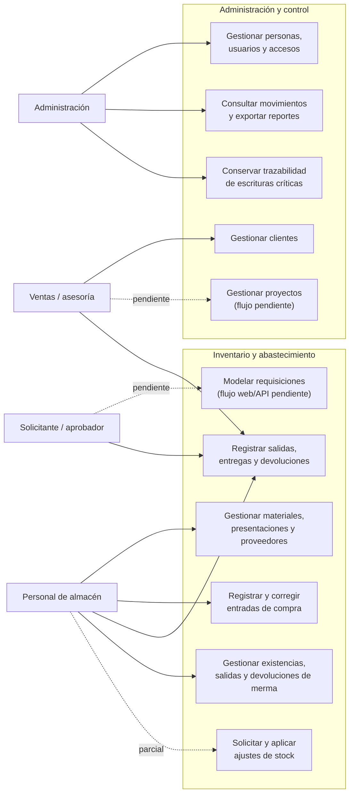
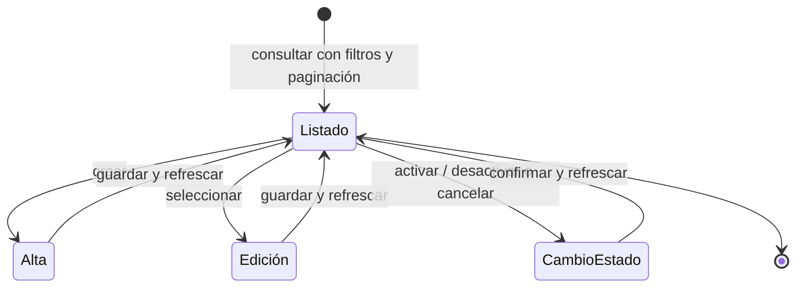
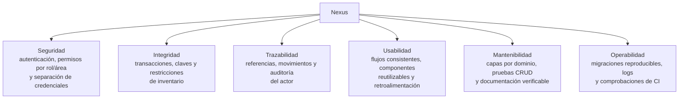
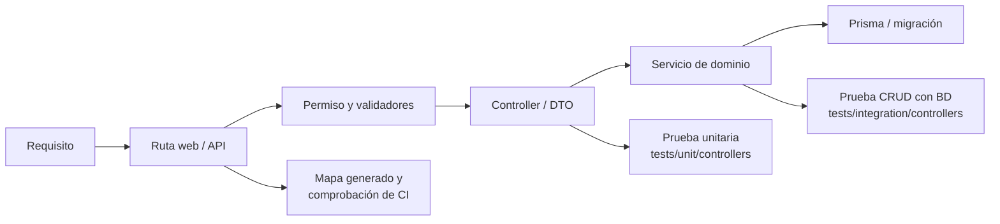

# Diagramas de requisitos

Este documento resume visualmente el alcance observable de Nexus y relaciona actores,
capacidades y atributos de calidad. La definición, estado, criterios de aceptación y
reglas de negocio se detallan en la
[especificación de requisitos](requirements-specification.md). Este archivo es un mapa
para conversación y revisión: las rutas del
[mapa generado](generated/code-map.md), el esquema Prisma y las pruebas siguen siendo
las fuentes verificables de implementación. Estas vistas aplican las
[convenciones y patrones para diagramas](diagram-conventions.md): cada sección conserva
un propósito, alcance, semántica y fuente de verdad definidos.

## Casos de uso funcionales por actor

Las flechas continuas representan capacidades disponibles; la línea discontinua indica
un caso modelado cuyo flujo todavía está pendiente. Cada caso se detalla mediante uno o
más requisitos `RF` en la especificación, sin convertir este mapa en un inventario de
endpoints.

## Ciclo de los requisitos CRUD

Los catálogos reutilizan un mismo ciclo de interacción, con autorización, validación y
reglas particulares según el recurso. Los documentos operativos agregan estados y
acciones de negocio sin duplicar el CRUD base.

## Requisitos de calidad y restricciones

## Trazabilidad del requisito a la evidencia

Al modificar un requisito se revisan su ruta, autorización, validación, persistencia y
pruebas relacionadas. La ubicación y estrategia de estas últimas se detalla en
[Estrategia y cobertura de pruebas](service-test-coverage.md).
