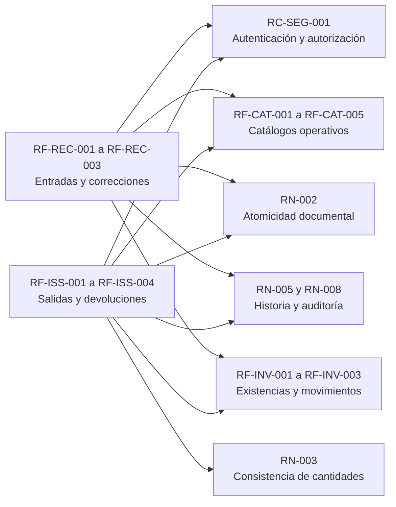
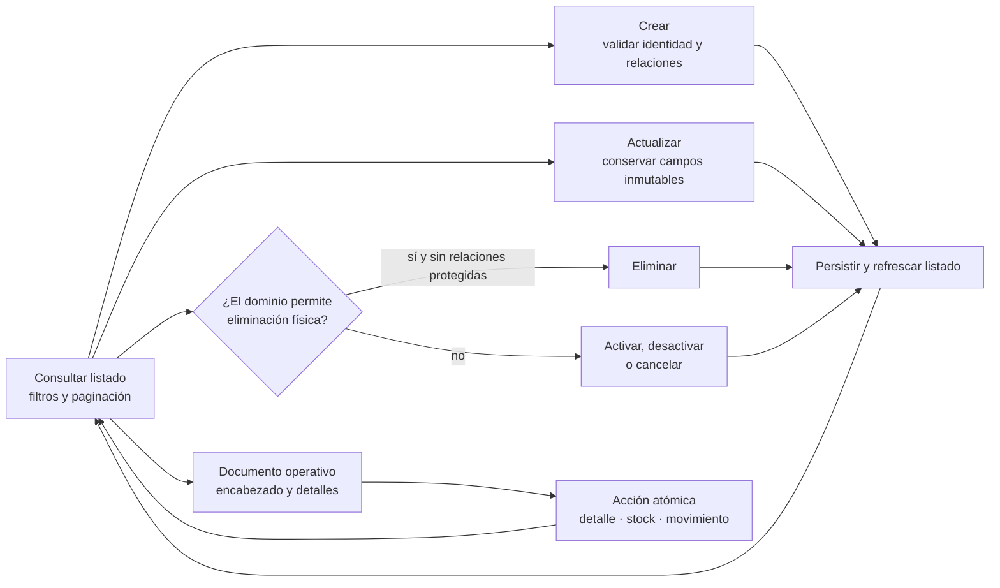
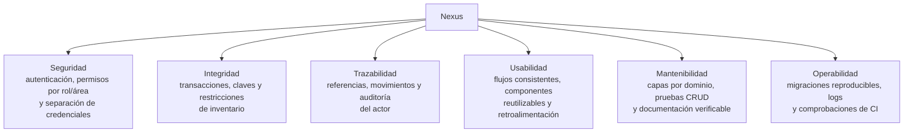
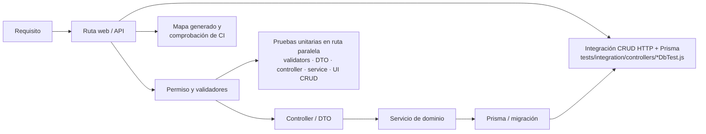

# Diagramas de requisitos

Este documento resume visualmente el alcance observable de Nexus y relaciona actores,
capacidades y atributos de calidad. La definición, estado, criterios de aceptación y
reglas de negocio se detallan en la
[especificación de requisitos](requirements-specification.md). Este archivo es un mapa
para conversación y revisión: las rutas del
[mapa generado](generated/code-map.md), el esquema Prisma y las pruebas siguen siendo
las fuentes verificables de implementación. Estas vistas aplican las
[convenciones y patrones para diagramas](diagram-conventions.md): cada sección conserva
un propósito, alcance, semántica y fuente de verdad definidos.

## Vista de requisitos y dependencias

Esta vista contiene **requisitos**, no actores ni casos de uso. Las operaciones del
usuario se muestran exclusivamente en el [diagrama de casos de uso](domain-and-use-cases.md#casos-de-uso-vigentes). Una flecha `A --> B` significa que el cumplimiento de `A`
depende de `B`; no representa navegación, permiso ni interacción humana.

El texto verificable y el estado de cada identificador se mantienen una sola vez en la
[especificación](requirements-specification.md#4-requisitos-funcionales). La
[matriz de operaciones](requirements-operations-matrix.md#matriz-vigente) documenta los
permisos, y el mapa generado documenta las rutas; repetirlos aquí mezclaría vistas.

## Ciclo vigente de los requisitos CRUD

Los catálogos reutilizan un mismo ciclo de interacción, con autorización y validación
particulares según el recurso. La eliminación física sólo aparece cuando las relaciones
del dominio la permiten; en los demás casos el ciclo usa activación, desactivación o
cancelación. Los documentos operativos reutilizan listado y formulario, pero agregan
acciones de detalle, stock y movimiento sin presentarlas como un CRUD idéntico.

Las flechas representan transiciones observables del usuario, no endpoints concretos.
La bifurcación de eliminación aplica `RN-007`; el límite atómico aplica `RN-002`. La
matriz de operaciones define cuál de estas ramas existe realmente para cada módulo.

## Requisitos de calidad y restricciones

## Trazabilidad del requisito a la evidencia

Al modificar un requisito se revisan su ruta, autorización, validación, persistencia y
pruebas relacionadas. La ubicación y estrategia de estas últimas se detalla en
[Estrategia y cobertura de pruebas](service-test-coverage.md).
