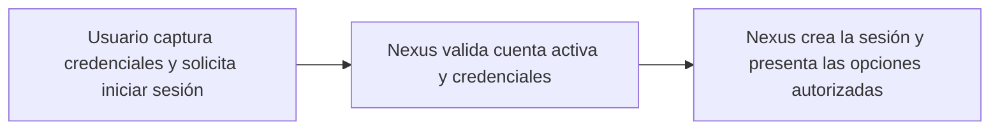

# `CU-AUT-01` — Iniciar sesión

```mermaid
flowchart LR
    accTitle: CU-AUT-01 — Iniciar sesión
    request["Usuario captura credenciales y solicita iniciar sesión"] --> validate["Nexus valida cuenta activa y credenciales"]
    validate --> result["Nexus crea la sesión y presenta las opciones autorizadas"]
```
