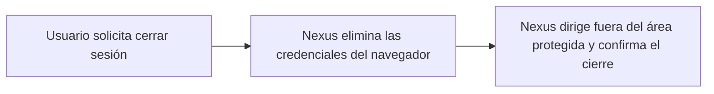

# `CU-AUT-02` — Cerrar sesión

```mermaid
flowchart LR
    accTitle: CU-AUT-02 — Cerrar sesión
    request["Usuario solicita cerrar sesión"] --> clear["Nexus elimina las credenciales del navegador"]
    clear --> result["Nexus dirige fuera del área protegida y confirma el cierre"]
```
