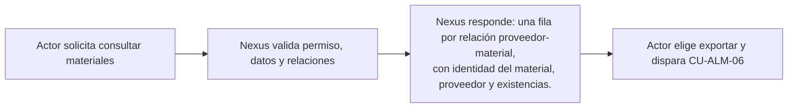

# `CU-ALM-01` — Consultar materiales

```mermaid
flowchart LR
    accTitle: CU-ALM-01 — Consultar materiales
    request["Actor solicita consultar materiales"] --> validate["Nexus valida permiso, datos y relaciones"]
    validate --> result["Nexus responde: una fila por relación proveedor-material,<br/>con identidad del material, proveedor y existencias."]
    result --> report["Actor elige exportar y dispara CU-ALM-06"]
```
