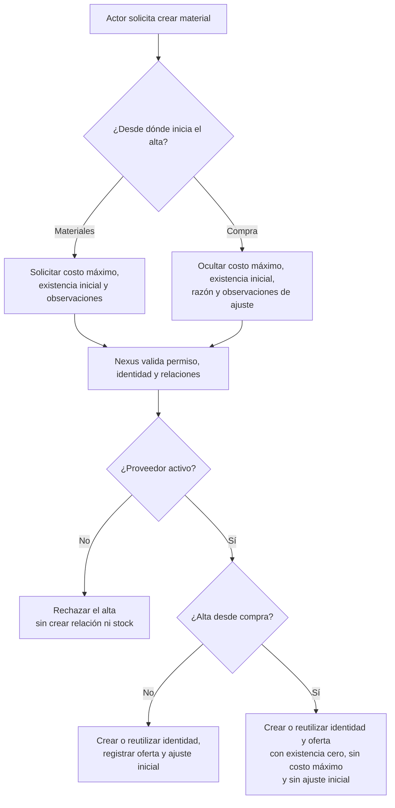

# `CU-ALM-02` — Crear material

```mermaid
flowchart TD
    accTitle: CU-ALM-02 — Crear material
    request["Actor solicita crear material"] --> context{"¿Desde dónde inicia el alta?"}
    context -->|Materiales| direct["Solicitar costo máximo,<br/>existencia inicial y observaciones"]
    context -->|Compra| purchase["Ocultar costo máximo, existencia inicial,<br/>razón y observaciones de ajuste"]
    direct --> validate["Nexus valida permiso, identidad y relaciones"]
    purchase --> validate
    validate --> active{"¿Proveedor activo?"}
    active -->|No| reject["Rechazar el alta<br/>sin crear relación ni stock"]
    active -->|Sí| origin{"¿Alta desde compra?"}
    origin -->|No| adjustment["Crear o reutilizar identidad,<br/>registrar oferta y ajuste inicial"]
    origin -->|Sí| zero["Crear o reutilizar identidad y oferta<br/>con existencia cero, sin costo máximo<br/>y sin ajuste inicial"]
```
