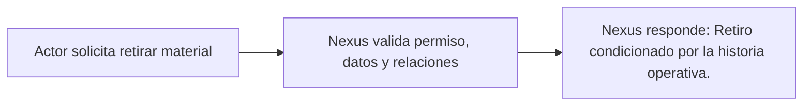

# `CU-ALM-04` — Retirar material

```mermaid
flowchart LR
    request["Actor solicita retirar material"] --> validate["Nexus valida permiso, datos y relaciones"]
    validate --> result["Nexus responde: Retiro condicionado por la historia operativa."]
```
