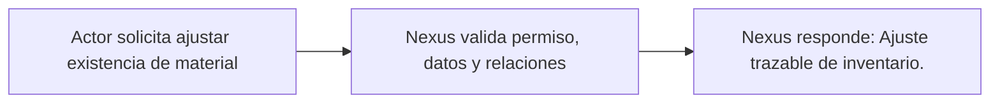

# `CU-ALM-05` — Ajustar existencia de material

```mermaid
flowchart LR
    request["Actor solicita ajustar existencia de material"] --> validate["Nexus valida permiso, datos y relaciones"]
    validate --> result["Nexus responde: Ajuste trazable de inventario."]
```
