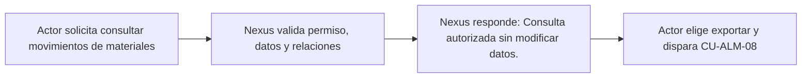

# `CU-ALM-07` — Consultar movimientos de materiales

```mermaid
flowchart LR
    request["Actor solicita consultar movimientos de materiales"] --> validate["Nexus valida permiso, datos y relaciones"]
    validate --> result["Nexus responde: Consulta autorizada sin modificar datos."]
    result --> report["Actor elige exportar y dispara CU-ALM-08"]
```
