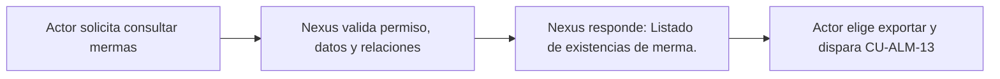

# `CU-ALM-09` — Consultar mermas

```mermaid
flowchart LR
    accTitle: CU-ALM-09 — Consultar mermas
    request["Actor solicita consultar mermas"] --> validate["Nexus valida permiso, datos y relaciones"]
    validate --> result["Nexus responde: Listado de existencias de merma."]
    result --> report["Actor elige exportar y dispara CU-ALM-13"]
```
