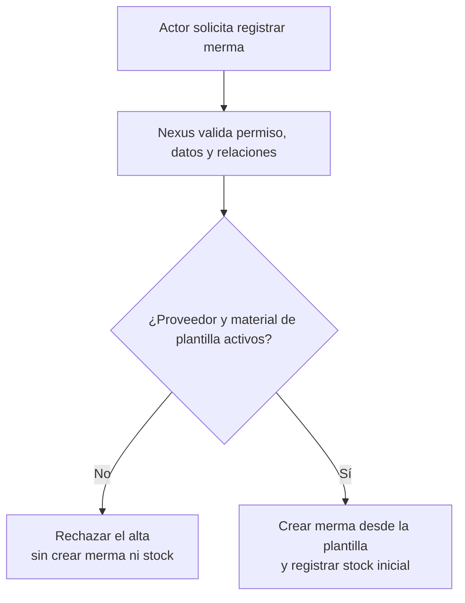

# `CU-ALM-10` — Registrar merma

```mermaid
flowchart TD
    accTitle: CU-ALM-10 — Registrar merma
    request["Actor solicita registrar merma"] --> validate["Nexus valida permiso, datos y relaciones"]
    validate --> active{"¿Proveedor y material de plantilla activos?"}
    active -->|No| reject["Rechazar el alta<br/>sin crear merma ni stock"]
    active -->|Sí| result["Crear merma desde la plantilla<br/>y registrar stock inicial"]
```
