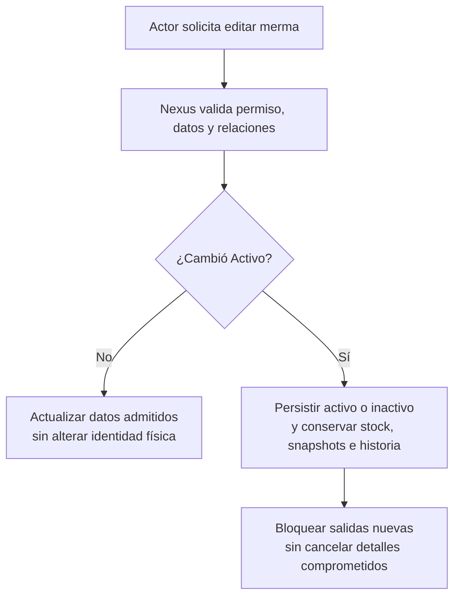

# `CU-ALM-11` — Editar merma

```mermaid
flowchart TD
    request["Actor solicita editar merma"] --> validate["Nexus valida permiso, datos y relaciones"]
    validate --> active{"¿Cambió Activo?"}
    active -->|No| result["Actualizar datos admitidos<br/>sin alterar identidad física"]
    active -->|Sí| preserve["Persistir activo o inactivo<br/>y conservar stock, snapshots e historia"]
    preserve --> boundary["Bloquear salidas nuevas<br/>sin cancelar detalles comprometidos"]
```
