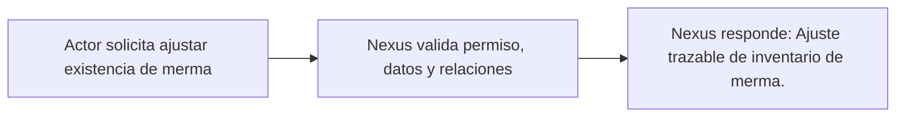

# `CU-ALM-12` — Ajustar existencia de merma

```mermaid
flowchart LR
    accTitle: CU-ALM-12 — Ajustar existencia de merma
    request["Actor solicita ajustar existencia de merma"] --> validate["Nexus valida permiso, datos y relaciones"]
    validate --> result["Nexus responde: Ajuste trazable de inventario de merma."]
```
