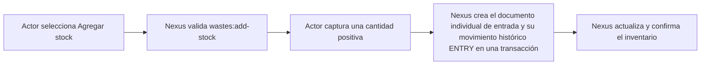

# `CU-ALM-13` — Agregar existencia de merma

```mermaid
flowchart LR
    request["Actor selecciona Agregar stock"] --> authorize["Nexus valida wastes:add-stock"]
    authorize --> quantity["Actor captura una cantidad positiva"]
    quantity --> transaction["Nexus crea el documento individual de entrada y su movimiento histórico ENTRY en una transacción"]
    transaction --> result["Nexus actualiza y confirma el inventario"]
```
