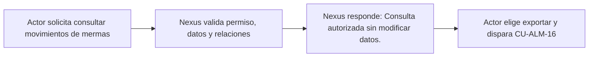

# `CU-ALM-15` — Consultar movimientos de mermas

```mermaid
flowchart LR
    accTitle: CU-ALM-15 — Consultar movimientos de mermas
    request["Actor solicita consultar movimientos de mermas"] --> validate["Nexus valida permiso, datos y relaciones"]
    validate --> result["Nexus responde: Consulta autorizada sin modificar datos."]
    result --> report["Actor elige exportar y dispara CU-ALM-16"]
```
