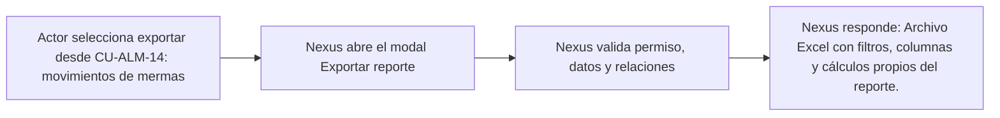

# `CU-ALM-15` — Generar reporte de movimientos de mermas

```mermaid
flowchart LR
    request["Actor selecciona exportar desde CU-ALM-14: movimientos de mermas"] --> modal["Nexus abre el modal Exportar reporte"]
    modal --> validate["Nexus valida permiso, datos y relaciones"]
    validate --> result["Nexus responde: Archivo Excel con filtros, columnas y cálculos propios del reporte."]
```
