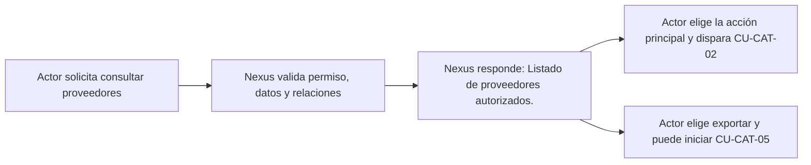

# `CU-CAT-01` — Consultar proveedores

```mermaid
flowchart LR
    request["Actor solicita consultar proveedores"] --> validate["Nexus valida permiso, datos y relaciones"]
    validate --> result["Nexus responde: Listado de proveedores autorizados."]
    result --> primary["Actor elige la acción principal y dispara CU-CAT-02"]
    result --> report["Actor elige exportar y puede iniciar CU-CAT-05"]
```
