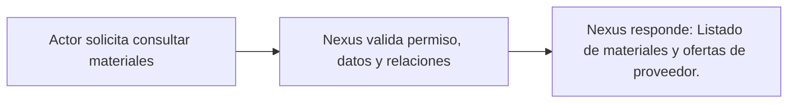

# `CU-CAT-01` — Consultar materiales

```mermaid
flowchart LR
    request["Actor solicita consultar materiales"] --> validate["Nexus valida permiso, datos y relaciones"]
    validate --> result["Nexus responde: Listado de materiales y ofertas de proveedor."]
```
