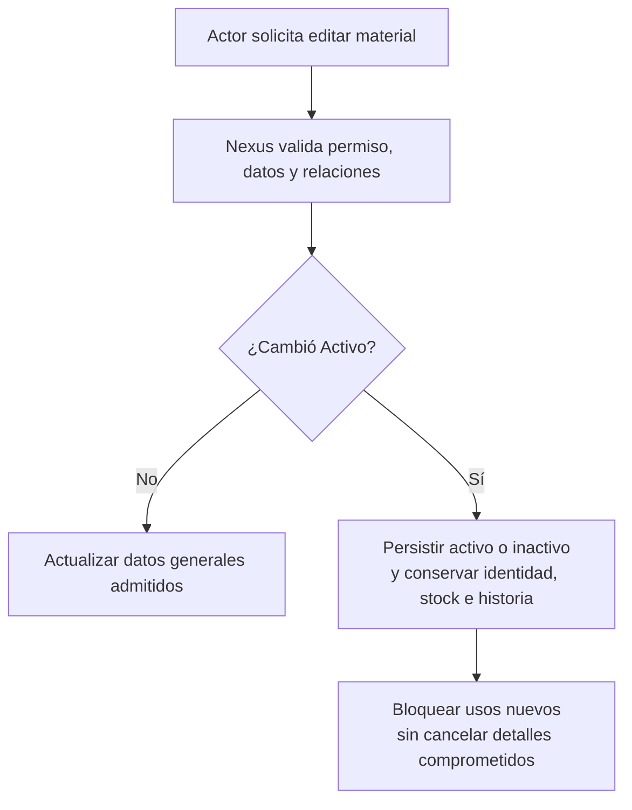

# `CU-CAT-03` — Editar material

```mermaid
flowchart TD
    request["Actor solicita editar material"] --> validate["Nexus valida permiso, datos y relaciones"]
    validate --> active{"¿Cambió Activo?"}
    active -->|No| result["Actualizar datos generales admitidos"]
    active -->|Sí| preserve["Persistir activo o inactivo<br/>y conservar identidad, stock e historia"]
    preserve --> boundary["Bloquear usos nuevos<br/>sin cancelar detalles comprometidos"]
```
