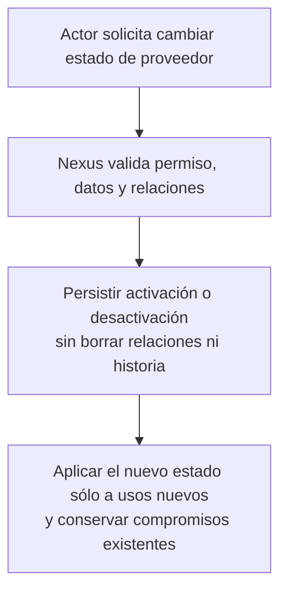

# `CU-CAT-04` — Cambiar estado de proveedor

```mermaid
flowchart TD
    request["Actor solicita cambiar estado de proveedor"] --> validate["Nexus valida permiso, datos y relaciones"]
    validate --> result["Persistir activación o desactivación<br/>sin borrar relaciones ni historia"]
    result --> boundary["Aplicar el nuevo estado sólo a usos nuevos<br/>y conservar compromisos existentes"]
```
