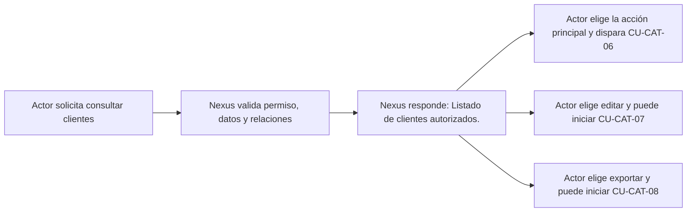

# `CU-CAT-05` — Consultar clientes

```mermaid
flowchart LR
    accTitle: CU-CAT-05 — Consultar clientes
    request["Actor solicita consultar clientes"] --> validate["Nexus valida permiso, datos y relaciones"]
    validate --> result["Nexus responde: Listado de clientes autorizados."]
    result --> primary["Actor elige la acción principal y dispara CU-CAT-06"]
    result --> edit["Actor elige editar y puede iniciar CU-CAT-07"]
    result --> report["Actor elige exportar y puede iniciar CU-CAT-08"]
```
