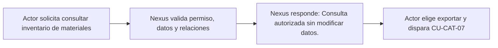

# `CU-CAT-06` — Consultar inventario de materiales

```mermaid
flowchart LR
    request["Actor solicita consultar inventario de materiales"] --> validate["Nexus valida permiso, datos y relaciones"]
    validate --> result["Nexus responde: Consulta autorizada sin modificar datos."]
    result --> report["Actor elige exportar y dispara CU-CAT-07"]
```
