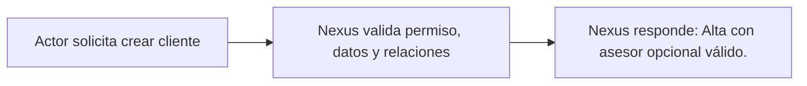

# `CU-CAT-07` — Crear cliente

```mermaid
flowchart LR
    request["Actor solicita crear cliente"] --> validate["Nexus valida permiso, datos y relaciones"]
    validate --> result["Nexus responde: Alta con asesor opcional válido."]
```
