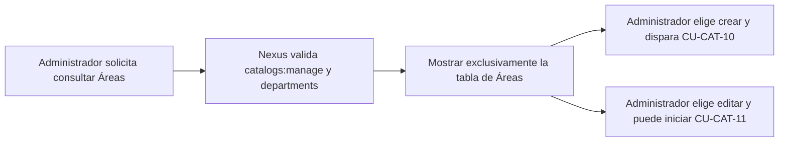

# `CU-CAT-09` — Consultar área

```mermaid
flowchart LR
    accTitle: CU-CAT-09 — Consultar área
    request["Administrador solicita consultar Áreas"] --> authorize["Nexus valida catalogs:manage y departments"]
    authorize --> result["Mostrar exclusivamente la tabla de Áreas"]
    result --> create["Administrador elige crear y dispara CU-CAT-10"]
    result --> edit["Administrador elige editar y puede iniciar CU-CAT-11"]
```
