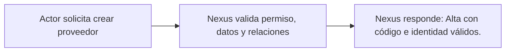

# `CU-CAT-10` — Crear proveedor

```mermaid
flowchart LR
    request["Actor solicita crear proveedor"] --> validate["Nexus valida permiso, datos y relaciones"]
    validate --> result["Nexus responde: Alta con código e identidad válidos."]
```
