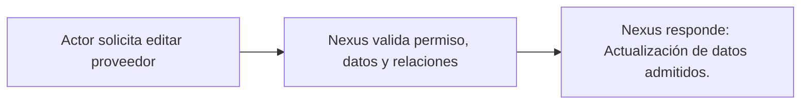

# `CU-CAT-11` — Editar proveedor

```mermaid
flowchart LR
    request["Actor solicita editar proveedor"] --> validate["Nexus valida permiso, datos y relaciones"]
    validate --> result["Nexus responde: Actualización de datos admitidos."]
```
