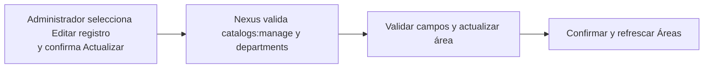

# `CU-CAT-11` — Editar área

```mermaid
flowchart LR
    accTitle: CU-CAT-11 — Editar área
    request["Administrador selecciona Editar registro<br/>y confirma Actualizar"] --> authorize["Nexus valida catalogs:manage y departments"]
    authorize --> persist["Validar campos y actualizar área"]
    persist --> result["Confirmar y refrescar Áreas"]
```
