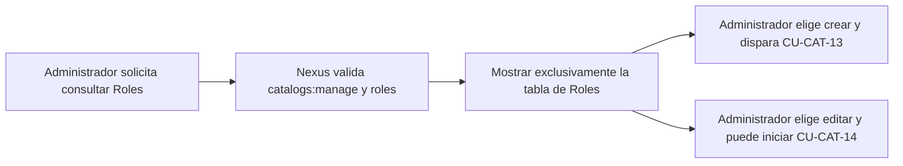

# `CU-CAT-12` — Consultar rol

```mermaid
flowchart LR
    accTitle: CU-CAT-12 — Consultar rol
    request["Administrador solicita consultar Roles"] --> authorize["Nexus valida catalogs:manage y roles"]
    authorize --> result["Mostrar exclusivamente la tabla de Roles"]
    result --> create["Administrador elige crear y dispara CU-CAT-13"]
    result --> edit["Administrador elige editar y puede iniciar CU-CAT-14"]
```
