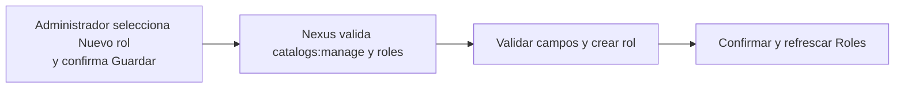

# `CU-CAT-13` — Crear rol

```mermaid
flowchart LR
    accTitle: CU-CAT-13 — Crear rol
    request["Administrador selecciona Nuevo rol<br/>y confirma Guardar"] --> authorize["Nexus valida catalogs:manage y roles"]
    authorize --> persist["Validar campos y crear rol"]
    persist --> result["Confirmar y refrescar Roles"]
```
