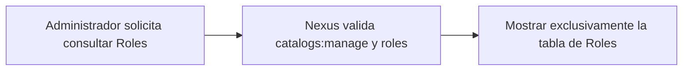

# `CU-CAT-13` — Consultar rol

```mermaid
flowchart LR
    request["Administrador solicita consultar Roles"] --> authorize["Nexus valida catalogs:manage y roles"]
    authorize --> result["Mostrar exclusivamente la tabla de Roles"]
```
