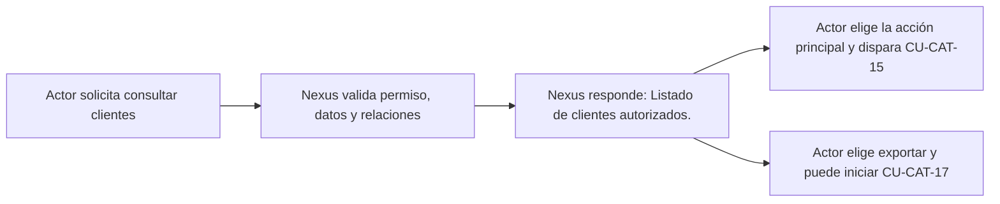

# `CU-CAT-14` — Consultar clientes

```mermaid
flowchart LR
    request["Actor solicita consultar clientes"] --> validate["Nexus valida permiso, datos y relaciones"]
    validate --> result["Nexus responde: Listado de clientes autorizados."]
    result --> primary["Actor elige la acción principal y dispara CU-CAT-15"]
    result --> report["Actor elige exportar y puede iniciar CU-CAT-17"]
```
