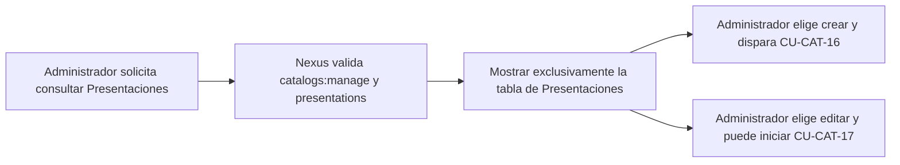

# `CU-CAT-15` — Consultar presentación

```mermaid
flowchart LR
    accTitle: CU-CAT-15 — Consultar presentación
    request["Administrador solicita consultar Presentaciones"] --> authorize["Nexus valida catalogs:manage y presentations"]
    authorize --> result["Mostrar exclusivamente la tabla de Presentaciones"]
    result --> create["Administrador elige crear y dispara CU-CAT-16"]
    result --> edit["Administrador elige editar y puede iniciar CU-CAT-17"]
```
