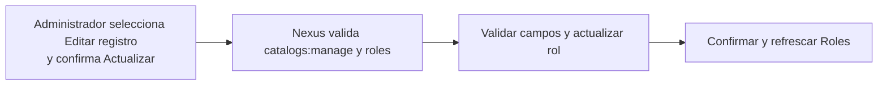

# `CU-CAT-15` — Editar rol

```mermaid
flowchart LR
    request["Administrador selecciona Editar registro<br/>y confirma Actualizar"] --> authorize["Nexus valida catalogs:manage y roles"]
    authorize --> persist["Validar campos y actualizar rol"]
    persist --> result["Confirmar y refrescar Roles"]
```
