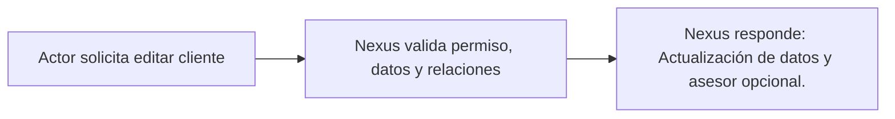

# `CU-CAT-16` — Editar cliente

```mermaid
flowchart LR
    request["Actor solicita editar cliente"] --> validate["Nexus valida permiso, datos y relaciones"]
    validate --> result["Nexus responde: Actualización de datos y asesor opcional."]
```
