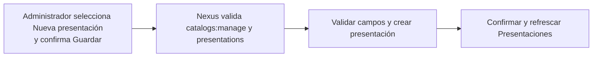

# `CU-CAT-16` — Crear presentación

```mermaid
flowchart LR
    accTitle: CU-CAT-16 — Crear presentación
    request["Administrador selecciona Nueva presentación<br/>y confirma Guardar"] --> authorize["Nexus valida catalogs:manage y presentations"]
    authorize --> persist["Validar campos y crear presentación"]
    persist --> result["Confirmar y refrescar Presentaciones"]
```
