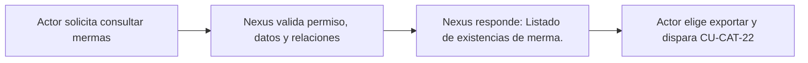

# `CU-CAT-18` — Consultar mermas

```mermaid
flowchart LR
    request["Actor solicita consultar mermas"] --> validate["Nexus valida permiso, datos y relaciones"]
    validate --> result["Nexus responde: Listado de existencias de merma."]
    result --> report["Actor elige exportar y dispara CU-CAT-22"]
```
