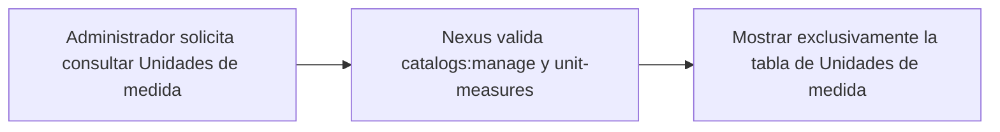

# `CU-CAT-18` — Consultar unidad de medida

```mermaid
flowchart LR
    request["Administrador solicita consultar Unidades de medida"] --> authorize["Nexus valida catalogs:manage y unit-measures"]
    authorize --> result["Mostrar exclusivamente la tabla de Unidades de medida"]
```
