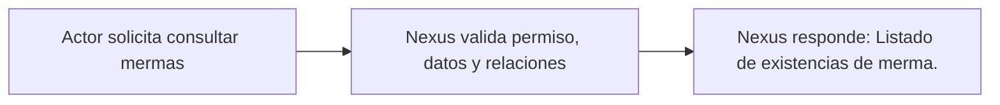

# `CU-CAT-19` — Consultar mermas

```mermaid
flowchart LR
    request["Actor solicita consultar mermas"] --> validate["Nexus valida permiso, datos y relaciones"]
    validate --> result["Nexus responde: Listado de existencias de merma."]
```
