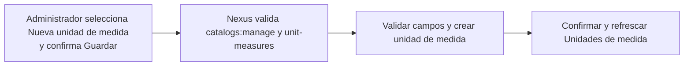

# `CU-CAT-20` — Crear unidad de medida

```mermaid
flowchart LR
    request["Administrador selecciona Nueva unidad de medida<br/>y confirma Guardar"] --> authorize["Nexus valida catalogs:manage y unit-measures"]
    authorize --> persist["Validar campos y crear unidad de medida"]
    persist --> result["Confirmar y refrescar Unidades de medida"]
```
