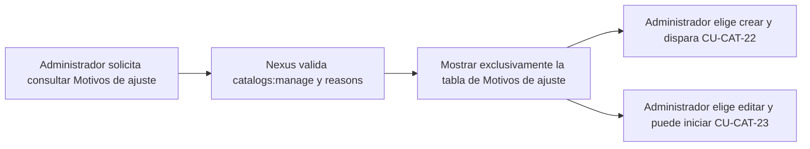

# `CU-CAT-21` — Consultar motivo de ajuste

```mermaid
flowchart LR
    accTitle: CU-CAT-21 — Consultar motivo de ajuste
    request["Administrador solicita consultar Motivos de ajuste"] --> authorize["Nexus valida catalogs:manage y reasons"]
    authorize --> result["Mostrar exclusivamente la tabla de Motivos de ajuste"]
    result --> create["Administrador elige crear y dispara CU-CAT-22"]
    result --> edit["Administrador elige editar y puede iniciar CU-CAT-23"]
```
