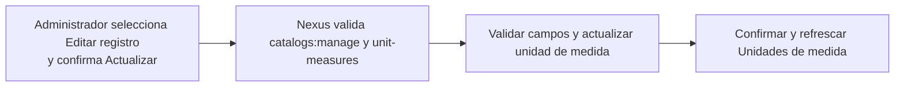

# `CU-CAT-21` — Editar unidad de medida

```mermaid
flowchart LR
    request["Administrador selecciona Editar registro<br/>y confirma Actualizar"] --> authorize["Nexus valida catalogs:manage y unit-measures"]
    authorize --> persist["Validar campos y actualizar unidad de medida"]
    persist --> result["Confirmar y refrescar Unidades de medida"]
```
