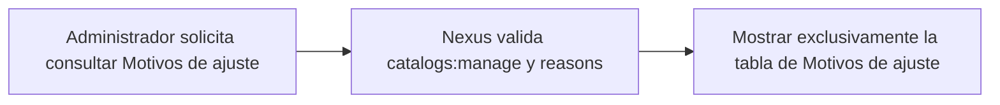

# `CU-CAT-22` — Consultar motivo de ajuste

```mermaid
flowchart LR
    request["Administrador solicita consultar Motivos de ajuste"] --> authorize["Nexus valida catalogs:manage y reasons"]
    authorize --> result["Mostrar exclusivamente la tabla de Motivos de ajuste"]
```
