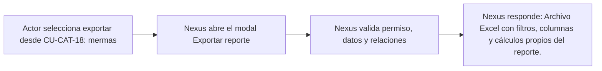

# `CU-CAT-22` — Generar reporte de mermas

```mermaid
flowchart LR
    request["Actor selecciona exportar desde CU-CAT-18: mermas"] --> modal["Nexus abre el modal Exportar reporte"]
    modal --> validate["Nexus valida permiso, datos y relaciones"]
    validate --> result["Nexus responde: Archivo Excel con filtros, columnas y cálculos propios del reporte."]
```
