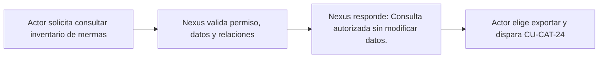

# `CU-CAT-23` — Consultar inventario de mermas

```mermaid
flowchart LR
    request["Actor solicita consultar inventario de mermas"] --> validate["Nexus valida permiso, datos y relaciones"]
    validate --> result["Nexus responde: Consulta autorizada sin modificar datos."]
    result --> report["Actor elige exportar y dispara CU-CAT-24"]
```
