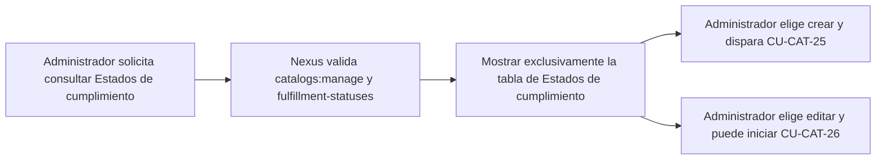

# `CU-CAT-24` — Consultar estado de cumplimiento

```mermaid
flowchart LR
    accTitle: CU-CAT-24 — Consultar estado de cumplimiento
    request["Administrador solicita consultar Estados de cumplimiento"] --> authorize["Nexus valida catalogs:manage y fulfillment-statuses"]
    authorize --> result["Mostrar exclusivamente la tabla de Estados de cumplimiento"]
    result --> create["Administrador elige crear y dispara CU-CAT-25"]
    result --> edit["Administrador elige editar y puede iniciar CU-CAT-26"]
```
