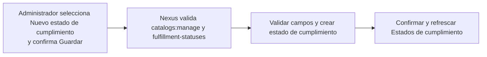

# `CU-CAT-25` — Crear estado de cumplimiento

```mermaid
flowchart LR
    accTitle: CU-CAT-25 — Crear estado de cumplimiento
    request["Administrador selecciona Nuevo estado de cumplimiento<br/>y confirma Guardar"] --> authorize["Nexus valida catalogs:manage y fulfillment-statuses"]
    authorize --> persist["Validar campos y crear estado de cumplimiento"]
    persist --> result["Confirmar y refrescar Estados de cumplimiento"]
```
