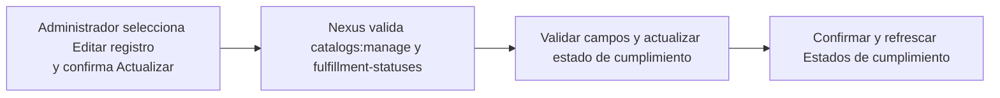

# `CU-CAT-26` — Editar estado de cumplimiento

```mermaid
flowchart LR
    accTitle: CU-CAT-26 — Editar estado de cumplimiento
    request["Administrador selecciona Editar registro<br/>y confirma Actualizar"] --> authorize["Nexus valida catalogs:manage y fulfillment-statuses"]
    authorize --> persist["Validar campos y actualizar estado de cumplimiento"]
    persist --> result["Confirmar y refrescar Estados de cumplimiento"]
```
