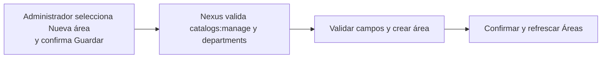

# `CU-CAT-26` — Crear área

```mermaid
flowchart LR
    request["Administrador selecciona Nueva área<br/>y confirma Guardar"] --> authorize["Nexus valida catalogs:manage y departments"]
    authorize --> persist["Validar campos y crear área"]
    persist --> result["Confirmar y refrescar Áreas"]
```
