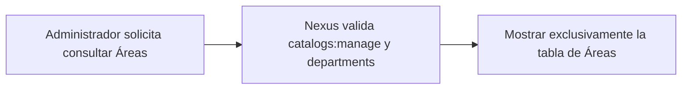

# `CU-CAT-27` — Consultar área

```mermaid
flowchart LR
    request["Administrador solicita consultar Áreas"] --> authorize["Nexus valida catalogs:manage y departments"]
    authorize --> result["Mostrar exclusivamente la tabla de Áreas"]
```
